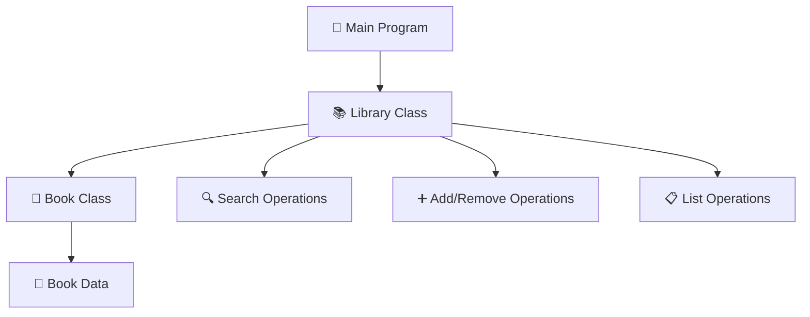

# 📚 Library Management System

<div align="center">


*A powerful, console-based Library Management System built with modern C++*

[Features](#-features) • [Quick Start](#-quick-start) • [Usage](#-usage) • [Contributing](#-contributing)

</div>

---

## ✨ Features

<table>
<tr>
<td>

### 📖 **Book Management**
- ➕ Add new books with detailed information
- 🗑️ Remove books using ISBN lookup
- 🔍 Smart search functionality by title
- 📋 Complete library catalog listing

</td>
<td>

### 🛠️ **Technical Excellence**
- 🎯 Object-oriented design patterns
- 🚀 STL algorithms for optimal performance  
- 💾 Dynamic memory management
- 🖥️ Interactive console interface

</td>
</tr>
</table>

## 🏗️ Architecture



### 🔧 Core Components

| Component | Description | Key Methods |
|-----------|-------------|-------------|
| **📖 Book** | Individual book entity | `getBook()`, `searchISBN()`, `searchTitle()` |
| **📚 Library** | Book collection manager | `addBook()`, `removeBook()`, `searchBook()`, `listBook()` |
| **🖥️ Interface** | User interaction layer | `showMenu()`, input validation |

## 🚀 Quick Start

### Prerequisites

```bash
# Ensure you have a C++ compiler installed
g++ --version  # Should show C++11 support or later
```

### 📦 Installation

```bash
# Clone the repository
git clone https://github.com/yourusername/library-management-system.git

# Navigate to project directory
cd library-management-system

# Compile the program
g++ -std=c++11 -o library_system main.cpp

# Run the application
./library_system
```

## 📖 Usage

### 🎮 Interactive Menu

```
┌─────────────────────────────────┐
│        📚 Library System        │
├─────────────────────────────────┤
│  1. ➕ Add Book                 │
│  2. 🗑️  Remove Book             │
│  3. 🔍 Search Book              │
│  4. 📋 List All Books           │
└─────────────────────────────────┘
```

### 💡 Example Workflow

```cpp
// Adding a new book
📖 Enter Book Details:
   Title: The Great Gatsby
   Author: F. Scott Fitzgerald  
   ISBN: 9780743273565
   Year: 1925
   
✅ Book added successfully!

// Searching for a book
🔍 Enter Title: The Great Gatsby

📖 Book found:
   Title: The Great Gatsby
   Author: F. Scott Fitzgerald
   ISBN: 9780743273565
   Year: 1925
```

## 🧬 Code Structure

<details>
<summary>📁 Project Structure</summary>

```
library-management-system/
├── 📄 main.cpp                 # Main application file
├── 📖 README.md               # This file
├── 📜 LICENSE                 # MIT License
└── 📁 docs/                   # Documentation
    └── 📊 class-diagram.md    # UML diagrams
```

</details>

<details>
<summary>🏗️ Class Hierarchy</summary>

```cpp
📖 Book Class
├── 🔒 Private Members
│   ├── string title
│   ├── string author
│   ├── string ISBN
│   └── int year
└── 🔓 Public Methods
    ├── 🏗️ Constructors (default & parameterized)
    ├── 📄 getBook() const
    ├── 🔍 searchISBN(string)
    └── 🔍 searchTitle(string)

📚 Library Class
├── 🔒 Private Members
│   └── vector<Book> Books
└── 🔓 Public Methods
    ├── ➕ addBook(...)
    ├── 🗑️ removeBook(string)
    ├── 🔍 searchBook(string)
    └── 📋 listBook()
```

</details>

## 🚀 Advanced Features

### 🎯 Smart Search with STL Algorithms

```cpp
// Lambda-powered search functionality
auto it = find_if(Books.begin(), Books.end(), 
    [&](Book& b) { return b.searchISBN(isbn); });
```

### 🛡️ Robust Input Handling

```cpp
// Mixed input type handling
cin.ignore();  // Clear buffer
getline(cin, title);  // Handle spaces in titles
```

## 🗺️ Roadmap

### 📅 Version 2.0 - Coming Soon!

- [ ] 🗃️ **File Persistence** - Save/load library data
- [ ] 👤 **User Management** - Library member system  
- [ ] 📊 **Advanced Analytics** - Usage statistics
- [ ] 🔄 **Book Status** - Available/borrowed tracking
- [ ] 📱 **GUI Version** - Cross-platform interface
- [ ] 🌐 **Web API** - RESTful service endpoints

### 🎨 Version 1.x Enhancements

- [ ] 🔍 Search by author & year
- [ ] 📈 Sort by multiple criteria  
- [ ] 📚 Multiple book copies support
- [ ] ⏰ Due date management
- [ ] 📧 Notification system

## 🤝 Contributing

<div align="center">

### We love contributions! 🎉

[](https://github.com/asg72/library-management-system/graphs/contributors)

</div>

### 🛠️ Development Setup

```bash
# 1. Fork the repository
# 2. Create your feature branch
git checkout -b feature/amazing-feature

# 3. Commit your changes  
git commit -m '✨ Add amazing feature'

# 4. Push to the branch
git push origin feature/amazing-feature

# 5. Open a Pull Request
```

### 📋 Contribution Guidelines

- 🎯 Follow existing code style and conventions
- ✅ Add tests for new functionality  
- 📝 Update documentation as needed
- 🐛 Include issue number in commit messages

## 📊 Stats

<div align="center">


</div>

## 📄 License

<div align="center">

This project is licensed under the **MIT License** - see the [LICENSE](LICENSE) file for details.

*Made with ❤️ by developers, for developers*

</div>

---

<div align="center">

### 🌟 Star this repo if you found it helpful!

[⬆ Back to Top](#-library-management-system)

</div>
